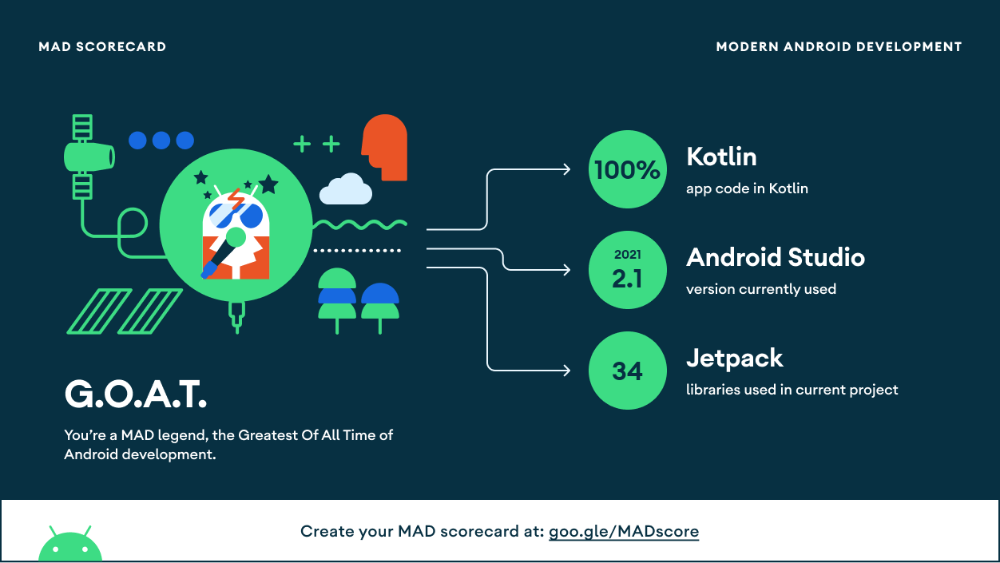
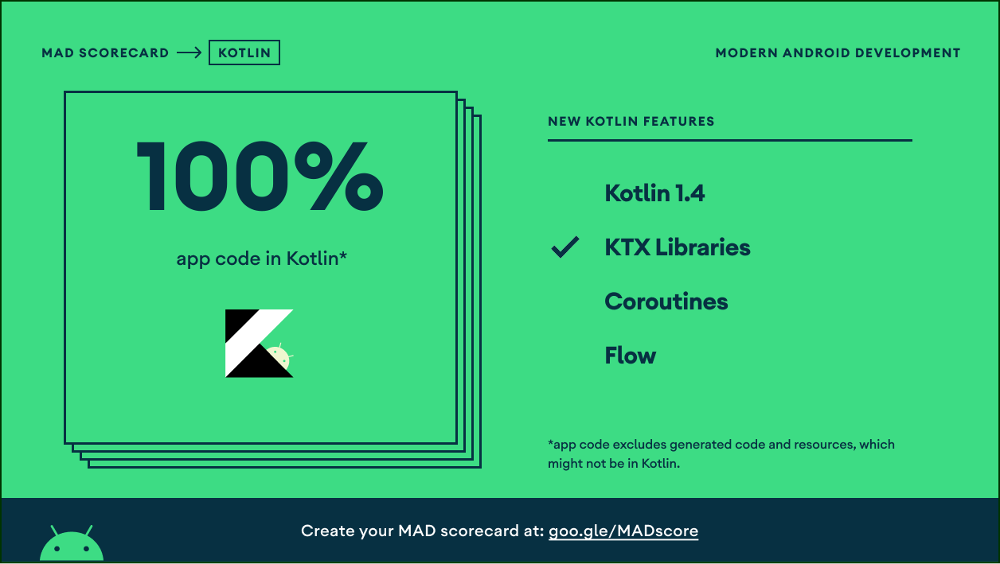
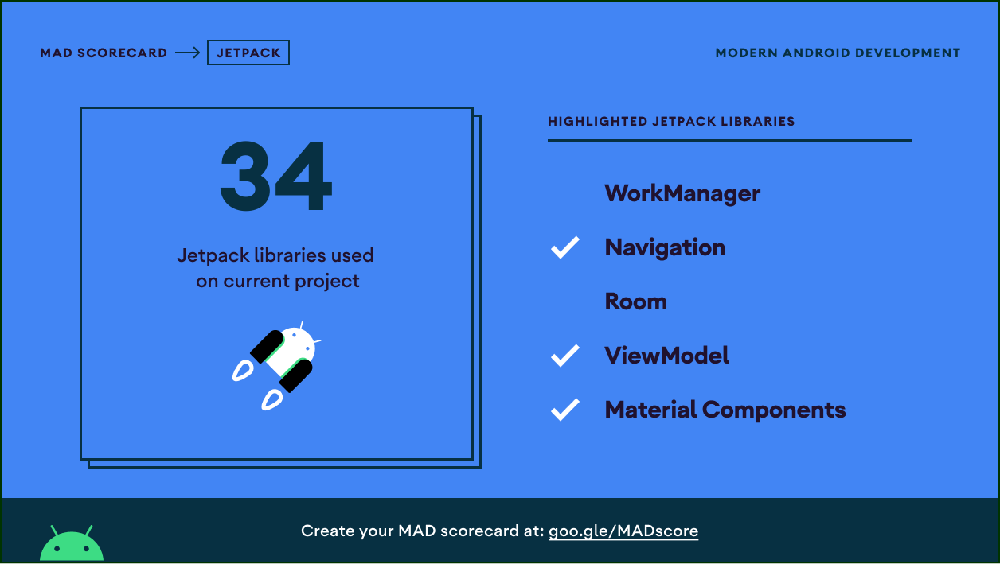
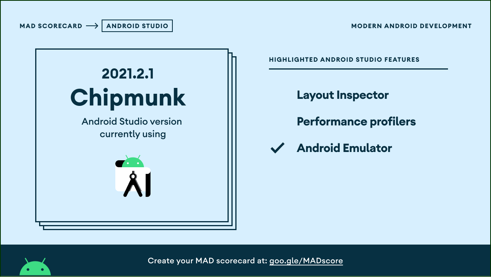

# FakeNews-App
[](http://developer.android.com/index.html) [](http://kotlinlang.org) [](https://developer.android.com/studio/releases/gradle-plugin)

# WARNING
**This application is not final because it is still in the development stage and still requires several supporting implementations to make the application run perfectly.**

# Table Of Contents
- [Introduction](#introduction)
- [Demo](#demo)
- [Tech Stack](#tech-stack)
- [Mad Scoreboard](#mad-scoreboard)

## Introduction

This application introduction is an innovation to help someone to avoid HOAX news by providing a news filter feature by validating the news whether it is indicated as a hoax or not.

**There are three buttons as follows:**

- Main Menu
> In the main menu feature there is a news display about any news that is indicated as a HOAX and if the news is pressed it will display news details and can check by pressing the news scanner button to indicate whether the news is HOAX news or not.

- Favorite
> In this application, there is a favorite feature to see what news has been favorited by the user. so that our group provides navigation favorites for additional features for FakeNews App users

- About App
> The last feature is about the application, this feature provides information about the application, starting from the version of the application then a feature is available to contact us, there is also information about questions and answers about HOAX news, & finally an explanation about the FakeNews app, to provide inside information to users about this application.

## Demo

|Splash|News List (Main Menu)|Valid|Hoax|
|--|--|--|--|
||||

## Tech Stack

- [Kotlin](https://kotlinlang.org/) - First class and official programming language for Android development.
- [Retrofit](https://square.github.io/retrofit/) - A type-safe HTTP client for Android and Java.
- [OkHttp](http://square.github.io/okhttp/) - An HTTP & HTTP/2 client for Android and Java applications.
- [Gson](https://github.com/google/gson) - A Java serialization/deserialization library to convert Java Objects into JSON and back
- [Glide](https://github.com/bumptech/glide) - An image loading and caching library for Android focused on smooth scrolling
- [Material Design](https://material.io/develop/android/docs/getting-started) - Material is a design system created by Google to help teams build high-quality digital experiences for Android, iOS, Flutter, and the web.
- [LottieFiles](https://lottiefiles.com/) - LottieFiles provides all the tools that you need to create, edit, test and display Lottie animations.

## Mad Scoreboard

<p align="center">
    
</p>

<p align="center">
    
</p>

<p align="center">
    
</p>

<p align="center">
    
</p>

## License
```

   Copyright © 2022 C22-PS051

   Licensed under the Apache License, Version 2.0 (the "License");
   you may not use this file except in compliance with the License.
   You may obtain a copy of the License at

       http://www.apache.org/licenses/LICENSE-2.0

   Unless required by applicable law or agreed to in writing, software
   distributed under the License is distributed on an "AS IS" BASIS,
   WITHOUT WARRANTIES OR CONDITIONS OF ANY KIND, either express or implied.
   See the License for the specific language governing permissions and
   limitations under the License.

```
